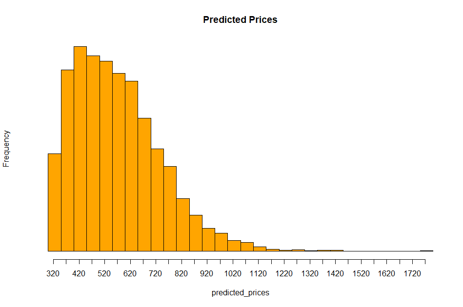

Orignally posted on my blog [jagekod.github.io](https:/jagekod.github.io/2025/09/02/Bayesian-auction.html)


**Bayesian inference for bidding on auctions**

I built a simple Bayesian model for estimating a fair price when bidding on auctions so I don't overpay for an item. I will not dwell deeper in to the beautiful world of *Bayesian statistics* here, I refer you to Ben Lambert's excellent book *"A Student's Guide to Bayesian Statistics"* for that.
You can also check out my master thesis *"Bayesian inference of biomarker dynamics in prostate cancer patients"* to see how I applied Bayesian inference on medical data to predict how cancer patients would reactad to treatment.

The simple idea here is that I use data from similar sold items that I am interested in, plug it into my Bayesian model assuming *complete pooling* and the *posterior* estimates the underlying distribution determining the end price for the auction, given the data and my underlying model. 

Here’s a visualization of the posterior distribution of the final price for an item I have data for. Here you can see that the most items will sell for around 500 SEK (currency is in swedish crowns), but it might sell for as low as 320 SEK and as high as >1000 SEK.



Now that we know the general shape of the posterior we can also look at the different quantlies. 

```r
quantile(predicted_prices, probs = c(0.1, 0.25, 0.5, 0.75, 0.9))
   10%      25%      50%      75%      90% 
369.7013 435.4274 543.6141 670.6084 793.7080
```

According to my model, if you want a 50% chance to win this auction you need to bid the 50% quantile price of 544 SEK. There is 10% chance that the item sells for <370 SEK and there is also 10% chance the items sells for >794 SEK. With this information you can make a better informed decision about how much you want to bid :)
